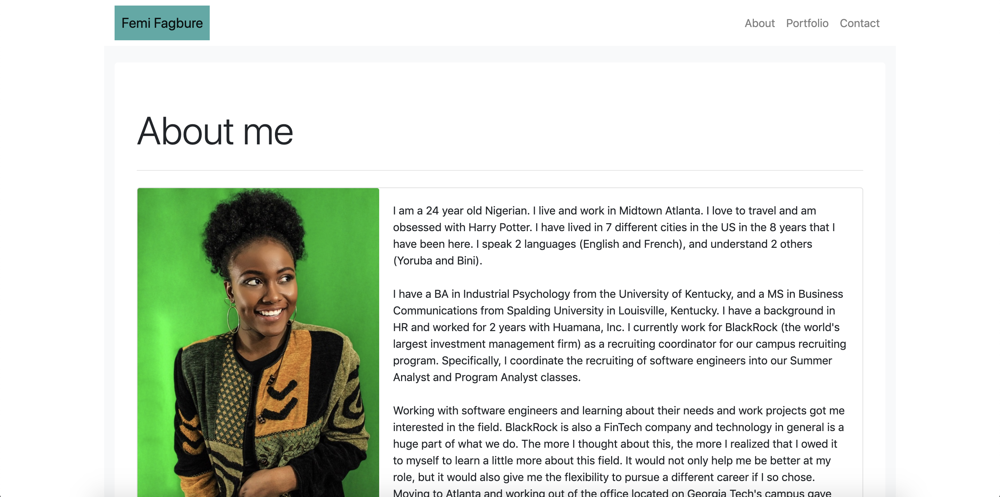
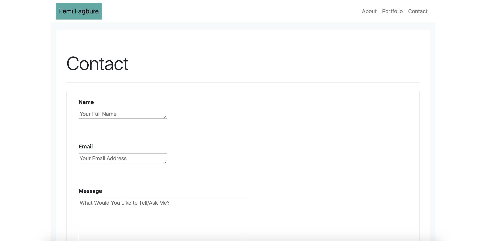
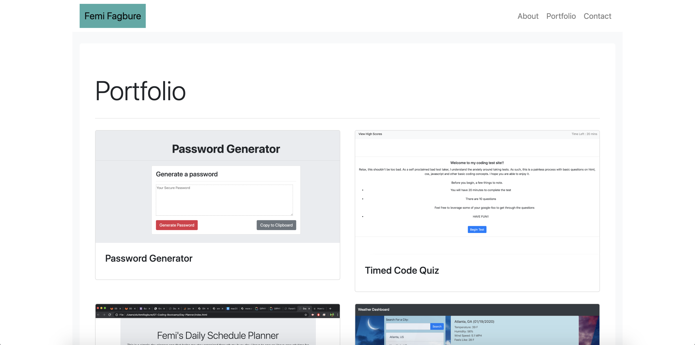

# Developer Profile
My personal developer profile that contains information about me, as well as my projects. You can view this website [here](https://ofagbure.github.io/Portfolio/)

## Description 

This is my Developer Profile. It is a place where prospective employees and fellow developers can get to know me better. As a novice in this field, I want to ensure that people know who I am, including my strengths, weaknesses, and areas for improvement/ potential. 

This profile page contains my personal information (background, interests, and a few more details about who I am), as well as a way for people to reach me, and examples of different projects I have worked on. As mentioned earlier, all are welcome to my page and I would be very happy to hear/ learn from you!

## Table of Contents 

* [About](#About)
* [Contact](#Contact)
* [Portfolio](#Portfolio)
* [License](#license)
* [Badges](#Badges)

## About
 
The first page of this project is the "About" page. As mentioned earlier, this page contains some very basic information about me, my background, interests, and why I have decided to pursue an education in coding. There is also a profile picture to give a better idea of who I am. On the most basic level, my profile page looks like the below.

## Contact

The contact page is a place for visitors to my site to reach out to me for more information. I welcome any who would do so. Most importantly, I welcome any suggestions for improvement, and/or advise on how to continually learn and grow in this field as it is a very new one for me.

## Portfolio

This page includes some of the projects I have/ aim to work on. More information  will be added to this page as my protfolio grows in the coming weeks - months. 

## License

MIT License

Copyright (c) [2020] [Olufemi Fagbure]

Permission is hereby granted, free of charge, to any person obtaining a copy
of this software and associated documentation files (the "Software"), to deal
in the Software without restriction, including without limitation the rights
to use, copy, modify, merge, publish, distribute, sublicense, and/or sell
copies of the Software, and to permit persons to whom the Software is
furnished to do so, subject to the following conditions:

The above copyright notice and this permission notice shall be included in all
copies or substantial portions of the Software.

THE SOFTWARE IS PROVIDED "AS IS", WITHOUT WARRANTY OF ANY KIND, EXPRESS OR
IMPLIED, INCLUDING BUT NOT LIMITED TO THE WARRANTIES OF MERCHANTABILITY,
FITNESS FOR A PARTICULAR PURPOSE AND NONINFRINGEMENT. IN NO EVENT SHALL THE
AUTHORS OR COPYRIGHT HOLDERS BE LIABLE FOR ANY CLAIM, DAMAGES OR OTHER
LIABILITY, WHETHER IN AN ACTION OF CONTRACT, TORT OR OTHERWISE, ARISING FROM,
OUT OF OR IN CONNECTION WITH THE SOFTWARE OR THE USE OR OTHER DEALINGS IN THE
SOFTWARE.

## Badges

